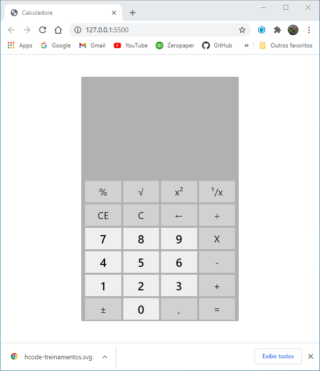
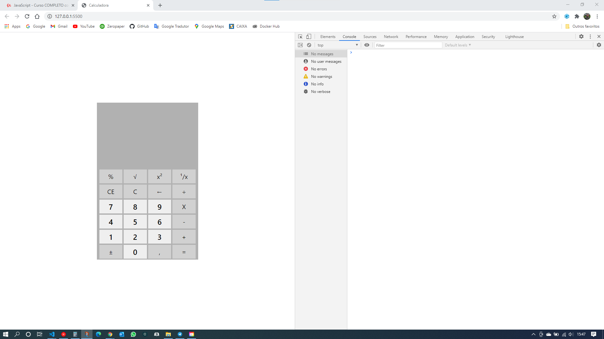
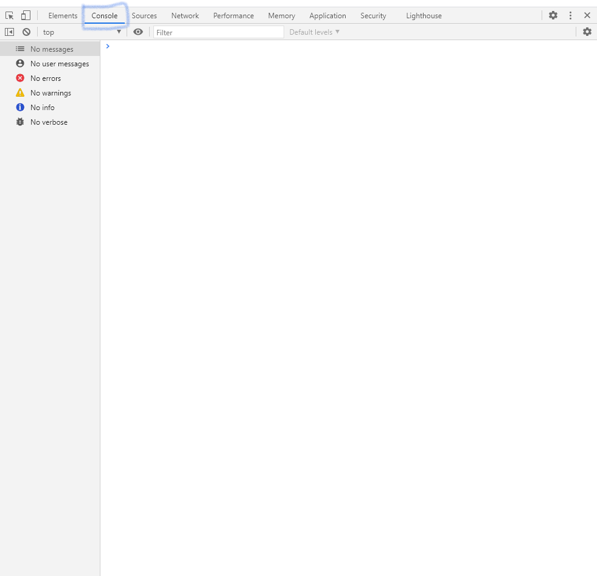
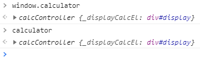
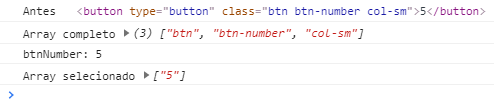
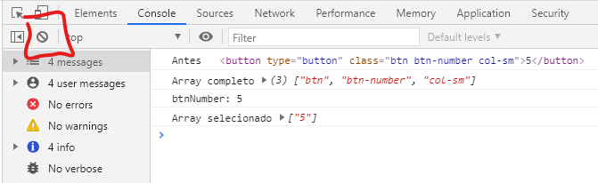
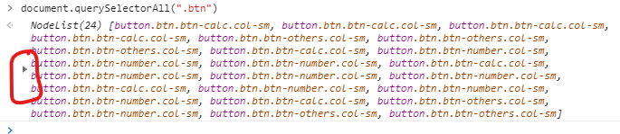
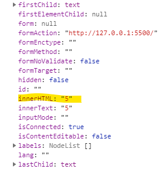

# Calculadora do windows 10 em HTML




Calculadora desenvolvida como exemplo do Curso Completo de JavaScript na Udemy.com.

## Projeto

O Projeto Calculadora é parte do curso de JavaScript oferecido pela Hcode. Na primeira parte do treinamento foi construída uma calculadora cuja a estrutura visual dela foi com base em uma imagem SVG. A proposta foi de introduzir, principalmente o conceito de Programação Orientada a Objetos e conhecer os comandos básicos de JavaScript.

Nesta fase, foi proposto o desafio de construir outra calculadora com html puro. Esse layout tem a mesma aparência de uma calculadora do Windows 10, lembrando que o curso foi gravado em 2018 e eu estou fazendo o curso em 2021. Evidentemente que a calculadora atual do Windows 10 tem outro layout e mais recursos.

> ### Importante
>
> O curso proposto é de JavaScript e portanto, não será abordado nenhum aspecto de HTML e CSS a não ser os ajustes que forem necessários para fazer o JavaScript funcionar. Futuramente poderá essa documentação poderá ser expandida a todo o projeto, para desenvolvedores que estão iniciando, assim como eu, tenham uma compreensão maior dessas três estruturas que compõem uma aplicação.

## Estrutura do projeto

A estrutura básica fornecida pela [Hcode](https://github.com.br) pode ser encontrada em [calculadora](https://github.com/hcodebr/curso-javascript-projeto-calculadora-win). Ao fazer o clone/fork do projeto, será encontrado o seguinte:

- Pasta node_modules contendo a estrutura bootstrap/sass que fornece o estilo da calculadora;
- index.html com o código HTML;
- README.md inicial, que neste caso está sendo desenvolvida toda essa documentação.

## Orientação a Objetos e MVC

Programação Orientada a Objetos - POO é uma forma de programar. Na Programação Orientada a Objetos a regra de negócio fica agrupada em classes, que podem ser utilizadas integral ou parcialmente.

### Classe

Uma classe é um conjunto de atributos e métodos. A classe por si só não contém dados. Ela é a estrutura, composta por atributos e métodos estruturados em trechos de código, que são equivalentes às variáveis e funções respectivamente. Esses trechos de código podem ser reutilizados sempre que precisar. Comparando uma classe a uma sala de aula, seria como se essa sala tivesse um professor e vários alunos distribuídos em grupos e cada grupo estivesse executando uma atividade diferente. O grupo de alunos seria equivalente ao método e cada aluno que fosse responsável por uma tarefa específica dentro desse grupo, seria o atributo.

### Objeto

Um objeto é o método utilizado para se utilizar uma classe. Toda vez que essa classe precisa ser utilizada, é criado um objeto que a represente. É como se fosse tirada uma cópia da classe para poder utilizar naquele momento. Quando um objeto chama uma classe, ele recebe toda a sua estrutura, insere dados dentro dela para que sejam produzidos os resultados esperados.

### Instância

Instância é quando um objeto representa uma classe, ou seja, o momento da ação em que o objeto está recebendo uma cópia da classe e executando as atividades necessárias.

### Método

É um conjunto de instruções composto por atributos, variáveis, funções e outros métodos para produzir um resultado.

Sintaxe:

```javascript
nomeDoMetodo() {
  this._atributo;
  let variavel = 'valorDaVariavel';
  ()=>{};
}
```

### Atributo

- Um atributo é similar a uma variável, porém, com mais recursos. Dentro de uma classe, o atributo ou método é identificado com a palavra reservada this. Ele faz referência ao objeto que foi instanciado. Ex.: Dois objetos são instanciados simultaneamente, chamando a classe Calculadora para executar operações diferentes. O this vai identificar a qual instância pertence cada comando e vai executar tarefas distintas.
- Sintaxe: `this.displayCalc = "0";`

### Conceito de MVC

MVC é a abreviatura de Model View Controller. Conceitualmente o **MVC** é uma organização entre os dados (model), o que é exibido (view) e as regras de negógio (controller), que são camadas distintas, facilitando a manutenção da aplicação. O **view** é a interface onde o usuário interage com a aplicação. As regras de negócio que dizem como as informações transitam na aplicação é determinada pelo **controller** e o **model** trata os dados. É ele quem vai até o banco de dados e acessa todas as informações trafegadas.

### Encapsulamento

- É o processo que controla o acesso a um atributo ou método. Existem três níveis de encapsulamento:
  - Public - todos acessam;
  - Protected - Atributos e métodos da mesma classe e classe pai;
  - Private - somente atributos e métodos da própria classe.

**Nota:** Um atributo ou método privado distingue-se do público por usar \"\_" antes do seu nome. Ex.: `this._displayCalc = "0";"`

**Nota 1:** O atributo `this._currentDate` não recebeu nenhum valor. Isso significa que é um atributo não definido ou undefined. Ele deverá receber valor em algum momento por meio de um método.

### DOM/BOM

- BOM (Browser Object Model) é a janela do navegador. Por exemplo, o comando para fechar a janela do navegador é `windwow.close`. onde close é uma propriedade de window.
- DOM (Document Object Model) é o conteúdo do próprio site. Tudo o que está contido no código HTML faz parte do DOM. Neste projeto foi criado o objeto calculator e sempre que a página HTML é carregada pelo navegador, para acessar as propriedades da calculadora, basta digitar `document.calculator` ou simplesmente `calculator`, porque calculator é uma propriedade que está dentro de document, assim como document está dentro de `window.document`.

- No JavaScript é possível manipular, tanto a janela quanto o documento, dependendo da necessidade. A manipulação do DOM/BOM deve ser feita de modo controlado, porque ao fazer essas manipulações estamos alterando informações que já foram renderizadas. A manipulação é feita por meio dos eventos, que são reações às ações externas, como o click de um botão ou a passagem do mouse sobre determinada área ou objeto.

- Cada tag ou elemento HTML é um objeto dentro do documento. No console do Inspector do Chrome, com o método document é possível ver todos os elementos HTML da página, já com a função dir() é possível ver todos esses elementos em forma de objeto.

**Nota:** ao inspecionar objeto window, estamos vendo todos os métodos e atributos da janela do navegador, notamos que o objeto tem um par de chaves logo após o seu nome. Isso significa que não é uma ação, portanto, não é um método. Todo método possui um par de parênteses indicando que ele executa uma ação. Ex.: `window.close()` window = objeto e close() é o método que fecha a janela do navegador.

**Nota 1:** Window é o objeto que engloba tudo o que está dentro da janela, inclusive document. Nesse caso, document se torna um método dentro de window, mas quando nos referimos a ele, propriamente dito, é o objeto que será referenciado em toda a manipulação do DOM.

### Getters and setters

Um atributo ou método privado não deveria ser acessado por um objeto, porém, no JavaScript é possível, mas, por convenção, não se faz isso, até porque, as únicas finalidades de se acessar um atributo é para ver o que tem dentro dele ou para alterar o seu valor. Nesse caso, usa-se os métodos nativos get e set, respectivamente para pegar ou alterar o seu valor.

### Navegador utilizado no projeto

O Browser escolhido para desenvolver o projeto e ver o resultado de cada passo da execução do código passo a passo foi o Google Chrome. Sabemos que existem diferenças de comportamento entre eles e como eu não sou um programador experiente, vou seguir o conselho daqueles que estão à minha frente e são minha referência no aprendizado.

> #### Inspecionar
>
> O Google Chrome possui uma ferramenta fantástica para desenvolvedores que nos ajuda em todo o caminho até a finalização do código. O inspetor permite o acesso ao código, exibindo todos os elementos HTML e o console, que permite executar qualquer código HTML, CSS e JS, além de mostrar eventuais erros na estrutura que foi carregada. Para carregar o inspetor de elementos, clique sobre a tela do navegador com a página que está em desenvolvimento carregada e escolher a opção inspecionar, a última do menu. O comando de atalho é o Ctrl + Shift + I. Para ir direto para o console, a tecla de atalho é a F12.
>
> Ao clicar em inspecionar a tela do navegador será dividida ao meio. o nosso documento estará à esquerda da tela e o painel de inspecionar elementos estará à esquerda. Existe uma quantidade enorme de recursos, tanto para desenvolvedores back end quanto para front end.
>
> 
>
> O trabalho não seria impossível sem o inspetor de elementos, mas com certeza ele facilita muito a nossa vida. A todo o momento podemos testar o compoatamento da aplicação antes e depois de aplicarmos o código.Durante todo o processo nós utilizaremos o console para demonstrar o que está acontecendo para facilitar o entendimento. Se você está começando a desenvolver agora, aconselho que repita cada exemplo e verá que vale a pena tê-lo como aliado.

#### Ferramenta console

> Observe a opção console no menu do inspetor de elementos. Ela será muito útil para testar nossos códigos e descobrir como eles se comportarão, mesmo antes de criarmos colocá-los nos elementos ou para ver o seu resultado depois de executados. Todo o espaço em branco que aparece na tela está disponível para os testes de comandos de linha.



#### console.log()

Esse é um método nativo do JS e uma execlente ferramenta de auxílio. Sempre que precisarmos exibir o resultado de um método que estamos criando para ver o comportamento está ou não, dentro do esperado, nós executamos o `console.log()` passando a variável, método ou atributo como parâmetros e o resultado será exibido na tela do inspetor, na tela do console.

## Mão na massa

Daqui por diante começaremos a desenvolver a aplicação da calculadora. Neste momento a única coisa que temos dela é o seu arquivo HTML que recebi da Hcode, como mencionado antes, que pode ser carregado pelo navegador.

Para que o index.html seja reconhecido pelo JavaScript é preciso adicionar as tags script e apontá-las para as pastas onde se encontram esses arquivos. Além disso, fiz outra alteração no nome da classe de algumas tags do teclado. Originalmente ele foi agrupado em duas classes distintas: a classs `btn_number`, que fazem referência ao teclado numérico e a class `btn-others`, apontando para todas as outras teclas. Para atender à minha lógica de programação, foi criada a classe `btn-calc`, que identifica todas as teclas que fazem algum tipo de cálculo.

### Atualização da estrutura

Seguindo o padrão MVC, O primeiro passo para começar o projeto é a criação da estrutura do JavaScript. Como boa prática de programação, foi criada a pasta assets, onde ficarão todos os ativos do projeto e dentro desta pasta foi criada a pasta js e dentro dela o arquivo calculator.js. Esse arquivo é responsável por criar o objeto calculadora, que será explicado posteriormente.

Dentro da pasta js foi criada a pasta controller e dentro dela, o arquivo calcController.js. Ele contem a classe calcController, responsável pelas operações da calculadora.

As tags HTML que fazem referência a esses arquivos estão no final do `<body>`. A ordem em que eles são chamados é imprescindível. O primeiro que deve ser encontrado é o arquivo contendo a classe e em seguida o que contem o objeto, porque para que um objeto seja criado, ou seja, para que a classe seja instanciada, ela precisa existir.

```javascript
// Chama os arquivos do JavaScript
<script src="assets/js/controller/calcController.js"></script>
<script src="assets/js/calculator.js"></script>
</body>
```

### Objeto calculator

O objeto calculator é o responsável por executar a classe CalcController. Como ele está na tag script do arquivo index.html, sempre que um elemento receber uma requisição do JavaScript, ele vai chamar a classe `CalcController{}` e em seguida o objeto `calculator = new CalcControler`, ou seja, vai instanciar a classe, criando um novo objeto, pronto para receber dados e efetuar as operações da calculadora.

#### Lógica da estrutura

- `calculator = new CalcController()` é uma forma abreviada de `window.calculator = new CalcController()`. Essa é a sintaxe para criar ou instanciar uma classe. window é um objeto _BOM_. Ele pertence à estrutura do navegador e está implícito no código. Veja na imagem abaixo, que com ou sem window, o resultado é o mesmo;

  - Resultado mostrado pelo console do inspetor:
    

- new significa que vai criar uma nova instância da classe.
- CalcController() executa o método construtor `calcController()`. Se esse método precisasse de parâmetros para ser executado, eles viriam dentro dos parênteses.

```javascript
calculator = new CalcController();
```

## Classe CalcController{}

Como boa prática, o nome de uma classe deve ser iniciado com letra maiúscula, diferente de atributos, que devem ser iniciados com letra minúscula. O padrão de nomes adotados pelo JavaScript para nomes de atributos é o camelCase, que inicia com letra minúscula e se o nome do arquivo for de múltiplas palavras, elas são iniciadas com letra maiúscula.

Todo o funcionamento da calculadora está dentro dessa classe. Cada atributo e método criado será devidamente documentado para que qualquer pessoa que esteja começando a programar, ou mesmo um desenvolvedor experiente que queira apenas inserir uma calculadora em seu projeto, saiba todos os detalhes de seu funcionamento, podendo, inclusive fazer alterações no seu código.

### Método constrcutor()

O método construtor tem a finalidade de sincronizar a classe com o código HTML. Ele é executado automaticamente todas as vezes que a classe é instanciada. Como boa prática, ele deve estar no topo do arquivo.

- sintaxe: `constructor(){}`

  - Os parênteses recebem os parâmentros para que o método funcione. No caso da calculadora não houve necessidade de receber nenhum parâmetro. Se um método receber mais de um parâmetro, eles vêm separados por vírgula
  - as chaves recebem as instruções do que deve ser feito.

- O atributo `this._operation` pertence ao método `addOperation()`e a sua única finalidade de agrupar as teclas pressionadas. Ele cria um array com cada uma delas aguardando pela operação a ser executada.

- O Atributo `this_.displayCalcEl` é responsável pela exibição dos dados do objeto no display da calculadora. Os dados são exibidos dentro da tag com o id #display, portanto, o `this_.displayCalcEl` recebe esse elemento por meio da propriedade nativa do JavaScript `document.querySelector("#display")`.

```javascript
class CalcController {
  constructor() {
    this._operation = [];
    this._displayCalcEl = document.querySelector("#display");
    this.initButtonsEvents();
  }
}
```

### Métodos get displayCalc() e set displayCalc()

Esses são os métodos get e set deste projeto. todos os métodos executam uma ação com o objetivo final de produzir um resultado para os alimentar.

- O método `get displayCalc()` retorna o valor para o atributo `this._displayCalcEl.innerHTML`. Toda vez que esse valor sofre uma mudança por quaisquer métodos da clase, ele é exibido no display da calculadora. Os eventos ocorridos dentro da classe com o objetivo de produzir um resultado, são, de modo geral, números, strings, arrays, etc, que não estão no formato dos elementos HTML. Para que seja possível exibir o resultado dentro da tag do display, a sua propriedade é manipulada pelo innerHTML.

- O método `set displayCalc()` é responsável por atualizar o valor do atributo `this._displayCalcEl` para que seja retornado para o display da calculadora. A sintaxe para executar esse método é `displayCalc = valor`.

### innerHTML

O innerHTML é uma propriedade do objeto que pode ser manipulada pelo DOM, coverter o conteúdo de uma variável em HTML e exibir o seu valor dentro de um elemento HTML do qual ele faz parte. Essa é uma das poucas propriedades que vai fugir à convenção de nomes, iniciando com letra minúscula e terminando com HTML todas as letras em maiúsculo.

```javascript
get displayCalc() {
    return this._displayCalcEl.innerHTML;
  }
  set displayCalc(value) {
    if (value.toString().length > 11) {
      this.setError();
      return false;
    }
    this._displayCalcEl.innerHTML = value;
  }
```

## Iniciando o teclado da calculadora

O teclado está dividido em três tipos de teclas:

- As numéricas, as que fazem algum tipo de cálculo e as demais, com outras finalidades.

Cada uma delas é identificada com três classes:

- a classe btn, para identificar todas elas de uma única vez; a classe btn-?, para clasificálas em grupo e a classe col-sm, do Bootstrap.

Os grupos para identificá-las são:

- btn-number para identificar as teclas numéricas;
- btn-calc para identificar as teclas de cálculo;
- btn-others para identificar as demais.

### Métodos initButtonsEvents() e addEventListenerAll()

#### Código

```javascript
 addEventListenerAll(element, events, fn) {
    events.split(" ").forEach((event) => {
      element.addEventListener(event, fn, false);
    });
  }

  initButtonsEvents() {
    let buttons = document.querySelectorAll(".btn");
    buttons.forEach((btn) => {
      this.addEventListenerAll(btn, "click drag", (e) => {
        let textBtn = btn.innerHTML.toString();
      });
    });
  }
```

O método initButtons é o responsável por carregar todas as teclas para o JavaScript. Para isso ele usa a propriedade nativa do JS `querySelectorAll()` que está dentro do objeto document. O evento `document.querySelectorAll` seleciona todos os elementos da classe `.btn`, que corresponde a todas as teclas e armazena na variável buttons.
Esses elementos são carregados tais quais estão dentro de suas tags, como pode ser visto pelo inspetor.


Como pode ser visto no exemplo no inspetor, logo abaixo, os elementos são identificados pelos seus índices que vão de 0 a 23. Os eventos click e drag são comandos distintos. O primeiro corresponde ao click do mouse e o segundo ao drag, que significa arrastar. Eles são eventos que são acionados pelo `addEventListener()`, evento nativo do JS que fica "escutando" as operações do mouse para dar uma resposta. Isso quer dizer que se o usuário clicar no botão e inadivertidamente arrastar o mouse dentro dele, a tecla desejada será acionada. Aqui nós temos um problema, porque o `addEventListener()` só consegue escutar um evento de cada vez. Para contornar esse problema, foi criado o método `addEventListenerAll()`. Veja que o método chama pelo `this.addEventListenerAll()`, passando os parâmetros necessários para ser executado. Os parâmetros que ele informa são:

- o `btn` que é a variável contendo cada botão encontrado pelo `forEach()`, como poderá ser visto abaixo;
- os eventos, que são o click e o drag;
- e por último, a função que deve ser executada em seguida.

Ao perceber o click do mouse, o `addEventListenerAll()` é executado da seguinte forma:

- O parâmetro events recebe o `click drag` do `initButtonsEvents()`. Ele é recebido pelo events em forma de string. Veja a simulação feita no inspetor do browser, que criamos uma variável chamada btn e passamos o valor para ela como está no nosso código. Ao solicitar o seu conteúdo, observe que eles estão entre parênteses, indicando que é uma string. Para confirmar executamos o evento typeof, que mostra o tipo da variável e a resposta foi "string."

#### Exemplo no inspetor

.

Esse formato não pode ser reconhecido como um evento, pois cada nome representa uma ação que deve ser executada. Para isso, eles precisam ser transformados em array. A função `split(" ")`, nativa do JS tem a capacidade de transformar uma lista de nomes dentro de uma string em arrays e para fazê-lo precisa encontrar um elemento em comum entre cada pedaço dessa string. No nosso exemplo, como são só dois itens, o espaço é o elemento comum aos dois. Observe que dentro dos parênteses da função tem um par de aspas e um espaço no meio delas. É aí que acontece a mágica. O Split separa os dois elementos e os transforma em um array, que agora pode ser executado pelo `forEach()`, que, por sua vez, os reconhece como sendo elementos distintos, podendo ser "ouvidos" pelo `addEventListener()`. Os elementos recebidos no parâmetro element se refere ao botão que acabou de receber o click.

Ao perceber o click, o drag ou os dois simultaneamente, aquele botão é colocado dentro do array e será acionado pelo `addEventListener()`. Na eventualidade dos dois eventos serem reconhecidos, seria produzido um resultado inesperando no display da calculadora, pois seriam considerados dois comandos e consequentemente aquela tecla seria acionada duas vezes. Para evitar possíveis erros, é passado o false que desconsidera o último evento, caso os dois fossem reconhecidos. Por fim, o parâmetro fn recebe a função que deve ser executada.

O `this.addEventListenerAll()` dentro do método `initButtonsEvents()` que deu origem à execução do método, recebe o resultado do click na variável `btnGroup` como array. Como explicado anteriormente, os elementos, que estão no formato de string precisam ser transformados em array quando queremos trabalhar com um intem específico. Aqui nós nos interessamos pelos elementos da classe. Mais especificamente o segundo item, que faz referência aos grupos de teclas btn-calc, btn-number e btn-others. O switch nos permite classificar esses grupos para diferente finalidades que serão aplicadas posteriormente. Depois de identificados os grupos, o método `execBtn()` é invocado para dar prosseguimento ao cálculo.

```javascript
iinitButtonsEvents() {
    let buttons = document.querySelectorAll(".btn");
    buttons.forEach((btn) => {
      this.addEventListenerAll(btn, "click drag", (e) => {
        console.log("Antes", btn);
        let btnGroup = btn.className.split(" ");
        console.log("Array completo", btnGroup);
        switch (btnGroup[1]) {
          case "btn-number":
            let btnNumber = btn.innerHTML;
            console.log("btnNumber:", btnNumber);
            this.execBtn(btnNumber);
            break;
          case "btn-calc":
            let btnCalc = btn.innerHTML;
            this.execBtn(btnCalc);
            break;
          case "btn-others":
            let btnOthers = btn.innerHTML;
            this.execBtn(btnOthers);
            break;
        }
      });
    });
```

Observe o processo de transformação no console:



O conteúdo vindo do método addEventListenerAll() é uma cópia do elemento HTML, mas não é o que nos interessa. Tudo o que queremos nesse momento é o conteúdo da tecla. Para resolver este problema podemos dar uma olhada no objeto que representa a tecla pressionada, que é o número 5. Vamos então, recorrer ao inspetor de elementos e fazer o seguinte no console:

- Limpe a tela do console clicando no botão destacado;



- Digite document.querySelectorAll(".btn"), tecle enter e clique no triângulo destacado para expandir o conteúdo gerado;



- Role a tela até encontrar a propriedade innerHTML: "5"



Este é o valor que nos interessa. Todo o resto do conteúdo será desprezado para o nosso propósito.

======
Ao receber uma tecla numérica

Se você quiser ver isso acontecendo no display da calculadora, insira o comando `displayCalc = textBtn`. Você se lembra que lá atrás nós criamos esse método. Agora é o momento de utilizá-lo passando o texto do botão para o set DisplayCalc. Ao inserir essa linha, abra a calculadora com o navegador, clique em qualquer tecla e veja ela sendo exibida no display da calculadora.

## Difinindo ações distintas para as teclas

Até o momento, se clicarmos em qualquer tecla, já teremos uma resposta, conoforme mostrado anteriormente, mas isso não nos serve para muita coisa. Se você jogou o conteúdo das teclas para o display da calculadora como mencionado anteriormente, verá que ao clicar em cada uma delas, o conteúdo é substituído. O que nós precisamos agora é começar a definir suas funções. para que as coisas comecem a fazer sentido.

Agora, com o conteúdo da tecla já identificado pelo método addEventListenerAll, executado pelo

### Métodos execBtn() e addOperation()

O método `execBtn(textBtn)` é acionado a partir do método `initButtonsEvents()` com o comando `this.execBtn(textBtn)`. porque é dentro dele que se encontra o conteúdo que nos interessa.

O método `execBtn()` recebe o valor da tecla pressionada e passa para o switch, que é uma estrutura de controle de fluso. Ele é usado para estruturas com possibilidades de ocorrências bem definidas e só poderá ocorrer uma delas. No caso do teclado, são 24 teclas, mas só pode ser pressionada uma de cada vez e cada uma produz um dado diferente.

As 24 possibilidades de teclas estão previstas na estrutura do switch. Ele recebe a variável, percorre a estrutura procurando se ela está na sua lista. Caso ela exista, é executada a instrução programada dentro do seu case e o código é encerrado imediatamente com a instrução break. Se não encontrar, é executada a condição default, que nesse caso, executa o método `this.setError()` que chama o método `setError()`, e emite a mensagem Error na tela da calculadora.

### Método addOperation()

Ao receber um click no teclado, o método `execBtn()` passa a informação para o `switch()`. Se for uma tecla numérica, ele chama este método com `this.addOperation(value)`, informando qual é o valor da tecla.

### Métodos clearAll() e clearEntry()
